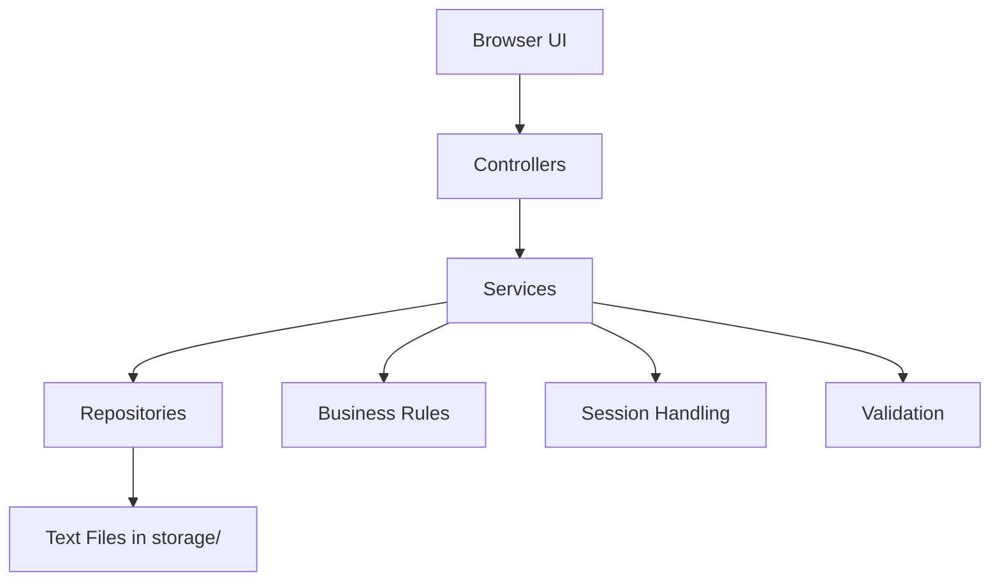

# Chapter Lane
## Online Bookstore Management System

[](https://www.oracle.com/java/)
[](https://spring.io/projects/spring-boot)
[](https://www.thymeleaf.org/)
[](#data-storage)
[](https://www.jetbrains.com/idea/)

Chapter Lane is a complete, presentation-ready **Online Bookstore Management System** built for the **SE1020 Object Oriented Programming Project**. It combines a polished bookstore interface with a structured Java backend, full CRUD-oriented module coverage, file-based data persistence, and an IntelliJ-friendly Spring Boot setup.

This project uses the assignment topic:

**Online Bookstore Management System**

The provided library documents were analyzed and used only as **sample/reference material** for workload structure. The final system, data, labels, UI, and workflows are all built for a **bookstore**, not a library.

---

## Table of Contents

- [1. Project Summary](#1-project-summary)
- [2. Assignment Alignment](#2-assignment-alignment)
- [3. Core Features](#3-core-features)
- [4. Member Contributions](#4-member-contributions)
- [5. Module Breakdown](#5-module-breakdown)
- [6. OOP Concepts Used](#6-oop-concepts-used)
- [7. Technology Stack](#7-technology-stack)
- [8. System Architecture](#8-system-architecture)
- [9. Project Structure](#9-project-structure)
- [10. Demo Accounts](#10-demo-accounts)
- [11. Setup Guide For Any PC](#11-setup-guide-for-any-pc)
- [12. How To Run In IntelliJ IDEA](#12-how-to-run-in-intellij-idea)
- [13. How To Run From Terminal](#13-how-to-run-from-terminal)
- [14. Data Storage](#14-data-storage)
- [15. UI and UX Highlights](#15-ui-and-ux-highlights)
- [16. Pages Included](#16-pages-included)
- [17. Viva and Demonstration Notes](#17-viva-and-demonstration-notes)
- [18. Troubleshooting](#18-troubleshooting)
- [19. Documentation Files](#19-documentation-files)

---

## 1. Project Summary

This system allows customers to browse books, create accounts, manage carts, place orders, and track purchases. It also provides an admin workspace to manage books, customers, orders, admins, and activity logs.

The project is designed to help achieve high marks by covering:

- strong backend Java logic
- clean OOP implementation
- file handling with text files
- multiple working UI screens
- attractive and responsive frontend design
- module separation suitable for team presentations

---

## 2. Assignment Alignment

| Requirement | How This Project Satisfies It |
|---|---|
| Java web application | Built with Spring Boot and Thymeleaf |
| IntelliJ IDEA | Maven project opens directly in IntelliJ |
| Minimum CRUD coverage | All five modules include CRUD-oriented operations |
| OOP concepts | Encapsulation, inheritance, polymorphism, abstraction |
| File handling | All main data is stored in `.txt` files under `storage/` |
| User-friendly UI | Responsive storefront and admin dashboard |
| Sample data | Automatically seeded at first run |
| Documentation | README, requirements analysis, class diagram |

Important note:

- The assignment mentions file handling as a major grading area.
- This project therefore uses **text-file persistence** instead of SQL.
- No SQL Server setup is required to run the system.

---

## 3. Core Features

### Customer Features

- register a new customer account
- log in as customer
- browse the bookstore catalog
- search and filter books
- add books to cart
- update cart quantities
- remove items from cart
- clear cart
- place orders
- view order history
- cancel eligible orders
- update profile information
- delete customer profile

### Admin Features

- log in as admin
- access admin dashboard
- view bookstore statistics
- manage customer accounts
- add new books
- update book information
- delete books
- search and filter orders
- update order status
- delete eligible orders
- create new admin accounts
- update admin accounts
- delete admin accounts
- record admin activity logs

### System Features

- automatic seed data on first startup
- file-based persistence using readable JSON lines in text files
- responsive frontend for desktop and mobile
- animated sections and polished visual design
- protected routes for customer and admin pages

---

## 4. Member Contributions

Use the table below in your final submission. If needed, replace the "Member" labels with actual student names and IDs before submission.

| Member | Assigned Area | Main Responsibility | Key Files / Screens |
|---|---|---|---|
| Member 1 | User Management | registration, login, profile update, delete, customer search/list | `AuthController`, `ProfileController`, `CustomerService`, `CustomerRepository`, `auth/login.html`, `auth/register.html`, `profile.html`, `admin/users.html` |
| Member 2 | Book Management | add, search, update, delete books, stock handling | `BookService`, `BookRepository`, `Book`, `PrintedBook`, `DigitalBook`, `catalog.html`, `admin/books.html` |
| Member 3 | Cart Management | add to cart, update quantity, remove item, clear cart | `CartController`, `CartService`, `CartRepository`, `Cart`, `CartItem`, `cart.html` |
| Member 4 | Order Management | checkout, order creation, order listing, cancel order, status updates | `OrderController`, `OrderService`, `OrderRepository`, `OrderRecord`, `OrderItem`, `orders.html`, `admin/orders.html` |
| Member 5 | Admin Management | admin CRUD, audit logs, admin dashboard, store control | `AdminController`, `AdminService`, `AuditService`, `Admin`, `AuditLogEntry`, `admin/dashboard.html`, `admin/admins.html` |

### Shared Foundation Work

These parts support all team members:

- `config/` for web configuration, interceptors, storage config, and Jackson config
- `fragments/` for reusable UI pieces
- `static/css/main.css` for the full visual system
- `static/js/app.js` for motion and interaction behavior

---

## 5. Module Breakdown

### User Management

Operations included:

- Create: customer registration
- Read: admin user listing and search
- Update: profile update
- Delete: customer delete

### Book Management

Operations included:

- Create: add new book
- Read: catalog listing, search, filter
- Update: edit existing book
- Delete: remove book

### Cart Management

Operations included:

- Create: add book to cart
- Read: view cart contents
- Update: update quantity
- Delete: remove item or clear cart

### Order Management

Operations included:

- Create: place order from cart
- Read: customer order history and admin order listing
- Update: change order status, cancel order
- Delete: delete eligible orders

### Admin Management

Operations included:

- Create: add admin account
- Read: list admins and recent logs
- Update: edit admin details
- Delete: remove admin account

---

## 6. OOP Concepts Used

| OOP Concept | Where It Is Used |
|---|---|
| Encapsulation | All model classes use private fields with getters/setters |
| Inheritance | `AppUser -> Customer/Admin`, `Book -> PrintedBook/DigitalBook` |
| Polymorphism | role behavior and book-type-specific display methods |
| Abstraction | abstract base classes and reusable repository/service layers |
| Information Hiding | controllers work through services, not direct storage logic |

### Important Class Relationships

- `AppUser` is the abstract base class for user types
- `Customer` and `Admin` inherit from `AppUser`
- `Book` is the abstract base class for book types
- `PrintedBook` and `DigitalBook` inherit from `Book`
- `JsonLineFileRepository<T>` abstracts repeated file read/write logic

---

## 7. Technology Stack

| Layer | Technology |
|---|---|
| Language | Java 21 |
| Framework | Spring Boot 4 |
| View Engine | Thymeleaf |
| Frontend | HTML, CSS, JavaScript |
| Styling | Custom CSS visual system |
| Build Tool | Maven Wrapper |
| IDE | IntelliJ IDEA |
| Persistence | Text files (`.txt`) |
| Testing | Spring Boot tests + MockMvc smoke tests |

---

## 8. System Architecture



### Layer Responsibilities

- Controllers:
  handle routes, forms, page navigation, redirects
- Services:
  apply business rules, authentication, cart/order logic, stock updates
- Repositories:
  read and write structured records to `.txt` files
- Storage:
  persist data between runs without using a database

---

## 9. Project Structure

```text
Bookstore-Management-System/
|
|-- src/
|   |-- main/
|   |   |-- java/com/bookstore/management/
|   |   |   |-- config/
|   |   |   |-- controller/
|   |   |   |-- dto/
|   |   |   |-- model/
|   |   |   |-- repository/
|   |   |   |-- service/
|   |   |   |-- util/
|   |   |
|   |   |-- resources/
|   |       |-- static/
|   |       |   |-- css/main.css
|   |       |   |-- js/app.js
|   |       |
|   |       |-- templates/
|   |           |-- admin/
|   |           |-- auth/
|   |           |-- error/
|   |           |-- fragments/
|   |           |-- index.html
|   |           |-- catalog.html
|   |           |-- cart.html
|   |           |-- orders.html
|   |           |-- profile.html
|   |
|   |-- test/
|       |-- java/com/bookstore/management/
|           |-- BookstoreManagementSystemApplicationTests.java
|           |-- WebSmokeTest.java
|
|-- docs/
|   |-- requirements-analysis.md
|   |-- class-diagram.md
|
|-- storage/                     (auto-created on first run)
|-- pom.xml
|-- mvnw
|-- mvnw.cmd
```

---

## 10. Demo Accounts

### Customer Accounts

- `maya@chapterlane.com` / `maya123`
- `nethmi@chapterlane.com` / `nethmi123`

### Admin Accounts

- `admin@chapterlane.com` / `admin123`
- `ops@chapterlane.com` / `ops12345`

These demo accounts are created automatically when the application starts for the first time.

---

## 11. Setup Guide For Any PC

This project can run on **Windows, macOS, or Linux**.

### Minimum Requirements

- JDK 21 or newer
- Internet connection for first Maven dependency download
- IntelliJ IDEA Community or Ultimate
- A modern browser

### Optional Tools

- Git
- Terminal / Command Prompt / PowerShell

### No Database Needed

- SQL Server is **not required**
- MySQL is **not required**
- All data is stored in local `.txt` files

### Step 1: Download the Project

You can get the project in either of these ways:

1. Clone from Git:

```bash
git clone <your-repository-url>
cd Bookstore-Management-System
```

2. Or download as ZIP and extract it.

### Step 2: Install Java

Install **JDK 21** or newer.

Check installation:

```bash
java -version
```

You should see Java 21 or a newer version.

### Step 3: Open the Project

- Open IntelliJ IDEA
- Choose **Open**
- Select the project folder
- Let IntelliJ import it as a **Maven** project

### Step 4: Wait for Dependencies

On the first run, Maven downloads required libraries automatically.

### Step 5: Run the App

Run `BookstoreManagementSystemApplication`.

### Step 6: Open the Website

Open:

```text
http://localhost:8080
```

---

## 12. How To Run In IntelliJ IDEA

### Recommended Method

1. Open the project in IntelliJ IDEA
2. Wait for Maven import to finish
3. Make sure the project SDK is set to **JDK 21**
4. Open:

```text
src/main/java/com/bookstore/management/BookstoreManagementSystemApplication.java
```

5. Click the green **Run** button
6. Open `http://localhost:8080`

### If IntelliJ Asks To Configure SDK

- Go to **File -> Project Structure**
- Set **Project SDK** to JDK 21
- Apply changes

---

## 13. How To Run From Terminal

### Windows

```powershell
.\mvnw.cmd spring-boot:run
```

### macOS / Linux

```bash
./mvnw spring-boot:run
```

### Build JAR File

Windows:

```powershell
.\mvnw.cmd clean package
```

macOS / Linux:

```bash
./mvnw clean package
```

### Run The Built JAR

```bash
java -jar target/bookstore-management-system-0.0.1-SNAPSHOT.jar
```

---

## 14. Data Storage

This project does not use a database. Instead, it stores data in text files inside the `storage/` directory.

### Files Created Automatically

- `customers.txt`
- `admins.txt`
- `books.txt`
- `carts.txt`
- `orders.txt`
- `audit-log.txt`

### Storage Format

- Each line is stored as JSON text
- Files remain human-readable
- Data persists between runs

### How To Reset Demo Data

If you want a fresh system:

1. stop the application
2. delete the `storage/` folder
3. start the application again

The system will recreate the files and seed demo data again.

---

## 15. UI and UX Highlights

The frontend was designed to feel more creative and presentation-ready than a standard CRUD system.

### Design Features

- editorial typography using custom Google Fonts
- layered gradients and blurred panels
- bookstore-style showcase cards
- floating background shapes
- scroll reveal animations
- sticky navigation and sticky side panels
- responsive layouts for desktop and mobile
- separate storefront and admin visual tone

### UX Goals

- clear navigation
- low visual clutter
- readable layouts for demos and screenshots
- attractive but still practical for marking and viva

---

## 16. Pages Included

### Public / Customer Pages

- Home page
- Catalog page
- Login page
- Register page
- Profile page
- Cart page
- Orders page

### Admin Pages

- Admin dashboard
- User management page
- Book management page
- Order management page
- Admin management page

### Shared UI

- reusable header
- reusable footer
- flash success/error messages
- access denied page

---

## 17. Viva and Demonstration Notes

This project is structured so each member can clearly explain their assigned module.

### Suggested Demo Order

1. show the home page and catalog
2. log in as customer
3. add books to cart
4. place an order
5. show order history
6. log out
7. log in as admin
8. manage books
9. manage users
10. update order status
11. manage admin accounts
12. show text files in `storage/`

### Good Backend Points To Explain

- why file storage was used
- how abstract classes support reuse
- how repositories avoid repeated file code
- how services separate business logic from controllers
- how stock is reduced on checkout and restored on cancellation
- how session-based route protection works

---

## 18. Troubleshooting

### Problem: Port 8080 is already in use

Change the port in:

```properties
src/main/resources/application.properties
```

Example:

```properties
server.port=8081
```

### Problem: Java not found

Install JDK 21 and check:

```bash
java -version
```

### Problem: IntelliJ does not load dependencies

- reimport the Maven project
- make sure internet is available
- confirm the project SDK is JDK 21

### Problem: You want fresh demo data

- delete the `storage/` folder
- rerun the app

---

## 19. Documentation Files

- Requirements analysis: [docs/requirements-analysis.md](docs/requirements-analysis.md)
- Class diagram: [docs/class-diagram.md](docs/class-diagram.md)

---

## Final Note

This project was designed not only to run correctly, but also to be easy to explain, easy to demonstrate, and strong against the marking guide. It is suitable for:

- live demos
- viva presentations
- backend code explanation
- OOP discussion
- file handling discussion
- submission as an IntelliJ-ready coursework project
