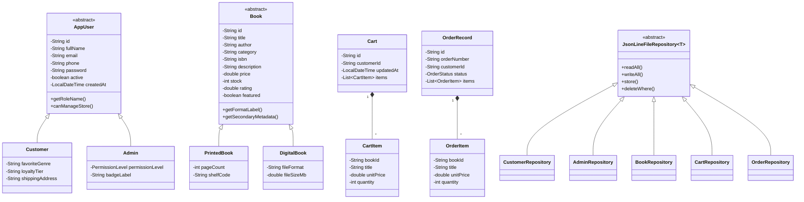

# Class Diagram

```mermaid
classDiagram
    class AppUser {
        <<abstract>>
        -String id
        -String fullName
        -String email
        -String phone
        -String password
        -boolean active
        -LocalDateTime createdAt
        +getRoleName()
        +canManageStore()
    }

    class Customer {
        -String favoriteGenre
        -String loyaltyTier
        -String shippingAddress
    }

    class Admin {
        -PermissionLevel permissionLevel
        -String badgeLabel
    }

    class Book {
        <<abstract>>
        -String id
        -String title
        -String author
        -String category
        -String isbn
        -String description
        -double price
        -int stock
        -double rating
        -boolean featured
        +getFormatLabel()
        +getSecondaryMetadata()
    }

    class PrintedBook {
        -int pageCount
        -String shelfCode
    }

    class DigitalBook {
        -String fileFormat
        -double fileSizeMb
    }

    class Cart {
        -String id
        -String customerId
        -LocalDateTime updatedAt
        -List~CartItem~ items
    }

    class CartItem {
        -String bookId
        -String title
        -double unitPrice
        -int quantity
    }

    class OrderRecord {
        -String id
        -String orderNumber
        -String customerId
        -OrderStatus status
        -List~OrderItem~ items
    }

    class OrderItem {
        -String bookId
        -String title
        -double unitPrice
        -int quantity
    }

    class JsonLineFileRepository~T~ {
        <<abstract>>
        +readAll()
        +writeAll()
        +store()
        +deleteWhere()
    }

    AppUser <|-- Customer
    AppUser <|-- Admin
    Book <|-- PrintedBook
    Book <|-- DigitalBook
    Cart "1" *-- "*" CartItem
    OrderRecord "1" *-- "*" OrderItem
    JsonLineFileRepository <|-- CustomerRepository
    JsonLineFileRepository <|-- AdminRepository
    JsonLineFileRepository <|-- BookRepository
    JsonLineFileRepository <|-- CartRepository
    JsonLineFileRepository <|-- OrderRepository
```
